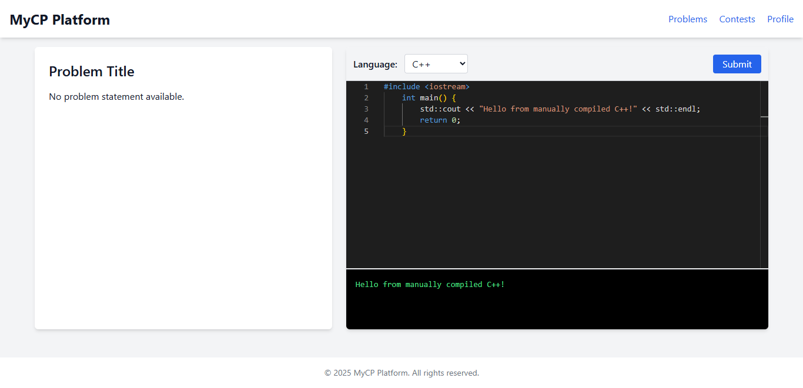

## 🚀 Demo




[](https://codecov.io/gh/ShaonMajumder/competitive-programming-platform)

-   upcoming CI/CD demo
-   upcoming UX demo
-   best practices demo

## 🛠️ Submission Engine Overview

-   💻 Code editor: Monaco
-   🌐 Language support: C/C++, Java, Python, JavaScript, etc.
-   📩 Judge queue: RabbitMQ / Redis Queue
-   🧱 Secure sandbox execution: Docker-based (planned)

## ✅ Continuous Integration (CI) with GitHub Actions

**Figure:** GitHub Actions running PHPUnit tests, when pushed to main branch


This project uses **GitHub Actions** for automated testing and validation on every push and pull request to the `main` branch.

### 🔄 What Happens in CI?

On each push or pull request to `main`:

1. **GitHub Actions is triggered automatically.**
2. The CI workflow sets up: PHP 8.0, MySQL 5.7, Redis (via Docker service container)
3. Executes: Installs composer dependencies, sets app key & directory permissions, runs db migrations, then phpunit tests with MySQL & Redis.

You can find the configuration file at: .github/workflows/laravel.yml

### 💡 Notes

-   ✅ **No SQLite is used** — tests run using your real **MySQL** and **Redis** services, just like your production/dev environment.
-   🧪 **Test failures or code issues automatically fail the workflow**, blocking broken PRs from merging into `main`.
-   🧹 The environment is isolated and reproducible, ensuring consistency across local and CI runs.

---

### 💡 Notes

-   ✅ **No SQLite is used** — tests run using your real **MySQL** and **Redis** services, just like your production/dev environment.
-   🧪 **Test failures or code issues automatically fail the workflow**, blocking broken PRs from merging into `main`.
-   🧹 The environment is isolated and reproducible, ensuring consistency across local and CI runs.

---

## 🧪 Testing Strategy

A solid test strategy ensures system reliability and developer confidence.

### ✅ Unit Testing

-   Written using **PHPUnit**
-   Covers:
    -   Core services
    -   Business logic
    -   Utility classes
-   Mocking used where necessary to isolate dependencies

### ✅ Integration Testing

-   Hits real **API endpoints**
-   Uses **real MySQL & Redis services** (Dockerized)
-   Verifies actual system behavior including:
    -   Database transactions
    -   Queued jobs
    -   Auth flows
-   Ensures both **success and failure paths** are tested
-   Database is reset or migrated cleanly between test runs

### ✅ Judge Simulation

-   End-to-end tests simulate actual code submission flows
-   The Judge service is mocked or stubbed for test environments
-   Supports future plug-in of a sandboxed Docker runner for full code evaluation

### 📊 Code Coverage (Partially Done)

GitHub CI badge support via `coverage.php` or `Xdebug`
Coverage reports via PHPUnit + Xdebug

**View the report:**

**Text:**

```bash
XDEBUG_MODE=coverage ./vendor/bin/phpunit --coverage-text
```

**HTML:**

```bash
php artisan test --coverage-html=storage/coverage-report
```

**Online report:** [Codecov Report](https://app.codecov.io/gh/ShaonMajumder/competitive-programming-platform)

---

## 🛡️ Engineering Best Practices

-   ✅ Follows Domain-Driven Design (DDD) — feature-based module separation
-   ✅ CI-ready with GitHub Actions integration (works with every push) : CD pending
-   ✅ Uses Dockerized services to reflect production setup
-   🔒 Plans to integrate secure sandbox execution (Docker-based)
-   🧪 End-to-end simulation tests ensure contest flows are validated
-   Docker-based infrastructure mimics production closely

## 🧠 Development Notes (WIP)

-   🚧 Continuous Deployment (CD) setup pending
-   ✅ Unit testing for core services
-   🧹 Static Analysis with PHPStan
-   🛠️ Integration testing in progress (DB setup ongoing)
-   Mocked judge service for end-to-end contest simulations : pending
-   🔄 Judge service simulation partially complete [java,nodejs,go]
-   📊 Code coverage + badge support (partially done)
-   Judge queue (RabbitMQ Queue) - currently laravel-queue used
-   Secure sandbox for code execution (Docker-based runner)
-   Use an in-memory or test database to avoid messing with production data.
-   Test both success and failure scenarios.
-   Clean up after tests in integration tests.
